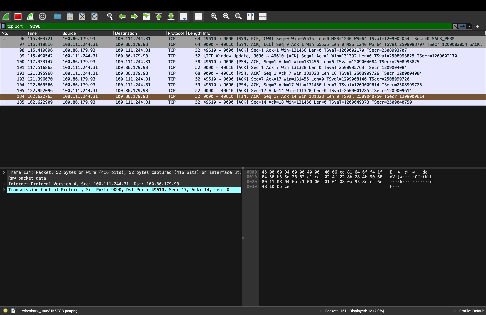

# Socket Programming - TCP and UDP Chat

## Membrii echipei
- Student A: Server în Ruby
- Student B: Client în Python

## TCP Chat

În varianta TCP, serverul pornește primul și ascultă pe portul 5000.
Clientul creează un socket TCP și se conectează la server folosind adresa IP și portul.
După conectare, clientul trimite primul mesaj, serverul îl citește și trimite un răspuns.
Comunicarea continuă până când unul dintre utilizatori trimite mesajul `exit`.

TCP folosește o conexiune stabilă și are handshake inițial format din SYN, SYN-ACK și ACK.

## UDP Chat

În varianta UDP, nu se stabilește o conexiune înainte de trimiterea mesajelor.
Clientul trimite mesajele direct către adresa IP și portul serverului folosind `sendto`.
Serverul răspunde către adresa și portul de unde a primit primul pachet.

UDP nu are handshake și nu confirmă primirea mesajelor.

## Diferențe TCP vs UDP

TCP este orientat pe conexiune, este mai sigur și garantează ordinea mesajelor.
UDP este fără conexiune, mai rapid, dar nu garantează livrarea sau ordinea mesajelor.

## Capturi Wireshark

### TCP
Aici se adaugă captura cu filtrul:

`tcp.port == 9090`

### UDP
Aici se adaugă captura cu filtrul:

`udp.port == 9090`
